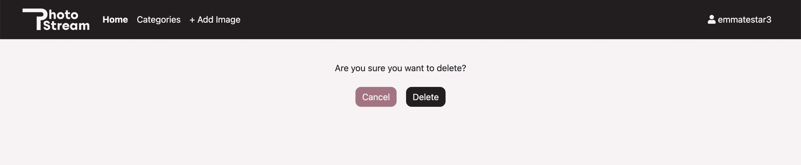
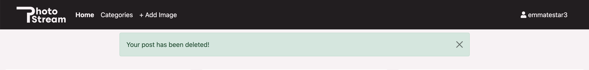
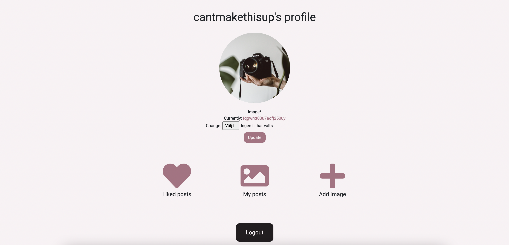
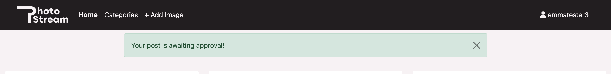

<h1>PhotoStream - Portfolio project 4</h1>
The Photostream Website is a website made for photography loving people. It is a place where they can share their best photos, but also view and interact with other members photos through liking or commenting.

<a href="https://evk-photostream-d1447cc37dcb.herokuapp.com/">Find the live project here.</a>

  
<h2>User Experience</h2>
<h3>User Stories</h3>

- As a user who is not logged in, i can:
    1. Get an overview of photos on the home page
    2. Open a post to view the image in full size
    3. Read the image description
    4. See users comments on a post
    5. See how many people has liked a post
    6. See a page displaying the different categories
    7. View the signup/sign in page
    8. Register an account

- As a logged in user of the website, I can:
    1. Get an overview of photos on the home page
    2. Open a post to view the image in full size
    3. Read the image description
    4. See users comments on a post
    5. Comment on a post
    6. Delete my own comments
    7. Delete comments on my posts
    8. See how many people has liked a post
    9. Like and unlike a post
    10. See an overview of the categories
    11. View my profile
    12. Update my profile picture
    13. Add a post (which needs to be approved by admin), update it and delete it
    14. View my liked posts
    15. Logout from the website

- As a superuser of the website, I can:
    1. Create, approve, update and delete posts
    2. Create and delete comments
    3. Add and delete users
    4. Add, update and delete categories

<h2>Design</h2>
<h3>Colors</h3>

- I have 3 primary colors used for the website.
- I have 2 secondary colors used for the website, these are used when hovering over links.
- I have also used white (#fff) as a base color under the images.

<h3>Typography</h3>
Roboto is used for the website.

<h3>Wireframes</h3>

- I used the design from the Code Institute walkthrough project, 'I think, therefore I blog', as a base for this site,
therefore, I did not create a wireframe for most of the views.
- I created this wireframe for the profile view.

<h2>Features</h2>
<h3>Home Page</h3>

- As soon as you open the site, you’re welcomed with the latest images uploaded to photo stream. The user can view 12 different posts, separated into 3 different columns. After this, the user can navigate to the next page. From there, it can easily navigate to the previous page.
- The user can see the title of the posts, when it was created and by whom, and see how many likes the post has.
  

  

<h3>Navbar</h3>

- The navbar displays the PhotoStream logo. For users who are not logged in, the navbar consists of three links. To the left, there’s the Home link as well as the Categories link. To the left, the user can find a login button, which will send them to the login page. 
  

- For users who are logged in, the navbar consists of four links. To the left the user can find the Home and Categories links, and a third button ”+ Add image”, which will send the user to the add image page. To the right is a profile link, which displays the user’s username. When clicked, the user is sent to the profile page. 
  

  

<h3>Footer</h3>

- In the footer, the company name is displayed, as well as four icon links to their social media.
  

  

<h3>Featured Image</h3>

- In the detailed image view, the user can see the image in full size, read the description, add a comment (if logged in), like the post (if logged in) and see other people’s comments.
  

  
- If it’s the user’s own post, the user can delete any comment made on the post by pressing the trash can icon, to create a safe and happy environment.
- If the user has published a comment on someone else’s post, it can delete it.
  

  
- If the user deletes a comment, a success manage shows saying the comment has been deleted. 
  

  
- If it’s the user’s own post, the user will see two buttons above the picture; Edit and Delete.
  

  
- If the user presses delete, it will get sent to the delete post page. If Edit is pressed, the user is sent to the edit post page.

<h3>Edit post</h3>

- The edit post is almost identical to the Add post page. The difference here is that the form is already filled out by the details provided when the user added the post. Below the form there’s two buttons; update and cancel. 
  

  
- If update is pressed, the post gets updated with the new details. The user get’s sent back to the home page with a success message of the image being edited successfully. 
- If cancel is pressed, the user get’s sent back to the image page with no registered updates.
  

  

<h3>Delete post</h3>

- The delete post page is a simple page with a question, making sure the user is sure to delete before proceeding. The user has the option of either pressing cancel and being sent back to the image page, or pressing delete. When pressing delete the user get’s redirected to the home page with a success message saying the post was deleted.
  

  

<h3>Categories</h3>

- In the categories page, the user can see an overview of the different categories.
  

  

<h3>Profile page</h3>

- In the profile page, logged in users can see their profile. By default, the profile picture is a default placeholder, but users can easily update it by pressing Choose File and then Update. It is presented with a default profile picture, and the user can choose their own profile picture by pressing Choose File and Update.
- Under the update profile picture form, the user can see three icons: Liked posts, My posts and Add post, by which they can proceed to the different pages. 
- At the bottom of the page, there’s a logout button which will send the user to the logout page.
  

  

<h3>Liked posts</h3>

- Under liked posts, the user can see which photos they have liked. The page looks like the home page, with the difference that it only shows the picture the user has liked. If the user clicks any image, it will be sent to the featured image view.
  

  

<h3>My posts</h3>

- Under my posts, the user can see their own photos. In comparison to the home page and ’liked posts’ page, this page does not display the publisher, since the user only sees their own post on this page. If they click the image, they get sent to the featured image view. 
  

  

<h3>Add image</h3>

- This page let’s the user post their photos. The user can see a form in which they can provide a title, choose an image, choose one or more categories and add a description. By clicking post, the post will be posted as a draft until admin has approved the post.
- After clicking post, the user get’s a success message informing them that the post is awaiting approval. The user also gets redirected to the home page.
  

  

<h3>Logout</h3>

- The logout page is accessed through the profile page. It is a simple page making sure the user actually wants to sign out.
- When pressing ”sign out”, the user get’s logged out and redirected to the home page, where the user gets a success message.
  

  

<h3>Login</h3>

- The login page is a simple form where the user provides it’s username and password. It can also click the ”remember me” box, to be remember until next time. There’s also a link on the page which will send you to the register page, for users who want to register.
  

  
- When pressing login, the user is redirected to the home page with a success message.
  

  
- If login fails, the user can see a text saying the login failed due to wrong username or password.
  

  

<h3>Sign Up</h3>

- On the sign up page, the user can fill out a form to register by providing a username, email (optional) and password. There’s also a link to the sign in page, for users who are already registered.
- When pressing register, the user gets logged in and redirected to the home page with a success message.
  

  

<h3>Admin page</h3>

- In the admin page, the admin can create, read, update and delete Categories, Comments, Posts, Profiles and Users. 
  

  

<h3>Future Features</h3>

1. Category View: Let users see posts based on which category they belong to. This was originally meant to be a feature with a base in the Categories Page, where user could click on the selected category and get sent to a post view with the images belonging to the chosen category. For this project, there wasn't enough time to implement it, but this should definitely be a feature in the future. The categories could also be displayed as a link under the post in Featured Image, where users could get redirected to the category they have pressed.
2. Extended User Profile: In future features, the user profile could be improved, where the user can fill out their name, contact details and other socials. 
3. View profiles: Let users view other people's profiles. 

<h2>Technologies</h2>
<h3>Languages</h3>

- HTML5
- CSS
- Javascript
- Python

<h3>Frameworks and programs</h3>

- <a href="https://getbootstrap.com/">Bootstrap</a> was used to style the page
- <a href="https://www.djangoproject.com/">Django</a> was used as framework
- <a href="https://github.com/">Github</a> was used to store the code
- <a href="https://www.gitpod.io/">GitPod</a> was used to create the site and push to GitHub
- <a href="https://www.elephantsql.com/">ElephantSQL</a> was used to store the database
- <a href="https://www.heroku.com/">Heroku</a> is used to host the site
- <a href="https://cloudinary.com/">Cloudinary</a> is used to store the images
- <a href="https://fonts.google.com">Google Fonts</a> was used to get fonts
- <a href="https://fontawesome.com/">FontAwersome</a> was used for icons

<h2>Testing</h2>
<a href="TESTING.md">See all test results here</a>

<h2>Deployment</h2>

1. Github
    - Create a new repository using the https://github.com/Code-Institute-Org/gitpod-full-template
    - After you have created a repository, click the green GitPod button
2. Install Django and libraries in the terminal
    - To install Django and gunicorn, type: pip3 install 'django<4' gunicorn
    - To install psycopg2, type: pip3 install dj_database_url==0.5.0 psycopg2
    - To install the Cloudinary libraries, type: pip3 install dj3-cloudinary-storage
    - Create a requirements file by typing: pip3 freeze --local > requirements.txt
    - Create your project by typing: django-admin startproject PROJECT_NAME . (PROJECT_NAME can be whatever you'd like it to)
    - Create the app by typing: python3 manage.py startapp APP_NAME (APP_NAME can be whatever you'd like it to)
    - In settings.py, add 'APP_NAME' to installed apps
    - Migrate the changes in the terminal, type: python3 manage.py runserver
    - You can see if the app got installed by typing: 'python3 manage.py runserver', without quotations marks, of course, in the terminal. If the app has been installed, you can now see a message saying that the install worked successfully.
3. Deploy to Heroku
    - Create a new app in Heroku
    - Enter a unique name, select your region and click Create App
    - In Settings, click Reveal Confiq vars
Click on the Create App button
    - Add a new confiq var called 'DATABASE_URL', the value should be your ElephantSQL database url.
    - Add a new confiq var called 'DISABLE_COLLECTSTATIC' with the value 1
    - Set a confiq var CLOUDINARY_URL with the value of your cloudinary url
    - Set a confiq var SECRET_KEY with a random key as value.
    - In the settings tab, choose Python as Buildpack.
    - In the deploy tab, scroll down to deployment method and choose GitHub, search for your repository name and connect.
    - Deploy by either choosing Automatic deploys or manual deploys. Click Deploy Branch.
    - In the terminal in GitHub, create a Procfile with the text 'web: gunicorn PROJECT_NAME.wsgi' (replace PROJECT_NAME with the name of your project)
4. Final deployment
    - Set DEBUG to False
    - Add this code under DEBUG = False -> X_FRAME_OPTIONS = 'SAMEORIGIN'
    - In Heroku, Settings, reveal confiq vars - remove the DISABLE_COLLECTSTATIC variable

<h2>Credits</h2>

- I have used the Code Institute walkthrough project "I think, therefor I blog" as a base for this project, which has helped a great deal in creating my project and app, as well as implementing models and views.
- I have used tutor support for issues that I wasn't able to solve myself even after troubleshooting. A special thanks to Ed who troubleshooted with me for an hour!
- I have gotten a lot of help from the <a href="https://djangocentral.com/building-a-blog-application-with-django/">Django Central Blog</a>
- I have gotten a lot of help from the Youtube channel <a href="https://www.youtube.com/@Codemycom">Codemy.com</a>
- I have also gotten help and inspiration from my fellow Code Institute students in Slack!