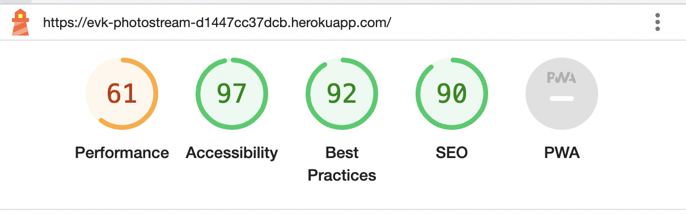
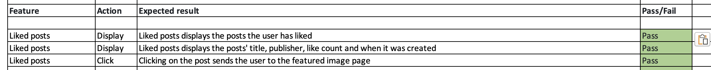

<h1>Testing<h1>

<h2>Automated testing</h2>
<h3>W3C Validator</h3>

<h3>Jigsaw Validator</h3>

<h3>CI Python Linter</h3>

All files came back with no errors. Files tested:

1. admin.py
2. apps.py
3. forms.py
4. models.py
5. signals.py
6. urls.py
7. views.py
8. asgi.py
9. settings.py
10. urls.py
11. wsgi.py

- For some lines in settings.py as well as urls.py, I have included  # noqa, where the strings were exceeding the limits.

<h3>Lighthouse<h3>

The performance on my page is pretty slow. My guess is that it is because of large image files. In the future, a maximum file size could be implemented to speed up the performance. 

<h2>Manual testing</h2>
<h3>Navbar</h3>

<h3>Footer</h3>

<h3>Homepage</h3>

<h3>Featured post</h3>

<h3>Edit Post</h3>

<h3>Delete post</h3>

<h3>Categories</h3>

<h3>Profile page</h3>

<h3>Liked Posts</h3>

<h3>My posts</h3>

<h3>Add image</h3>

<h3>Logout</h3>

<h3>Sign in</h3>

<h3>Sign Up</h3>

<h3>Admin</h3>

<h6><a href="https://docs.google.com/spreadsheets/d/1XKiDCKeqjjV3WEgfI65EEM_cxQoLCfQEF8VK-6H_JuQ/edit?usp=sharing">Link to google Test sheet here</a></h6>

<h2>Bugs</h2>

- When trying to create a profile page for the users, I ran into some issues. 
    - First, I got an error saying that "User has no profile"
    
    - I then created a signals.py file that created a profile for users, however it still did not work
    - I updated my apps.py file so that the signals file could be seen.
    
    - This time, I was able to create a profile, but not able to update it
    - I found out this was because I hadn't included the profile form as context in my views.py file for the profile_view.
    - After adding the context, all new users got a profile which they could update.
